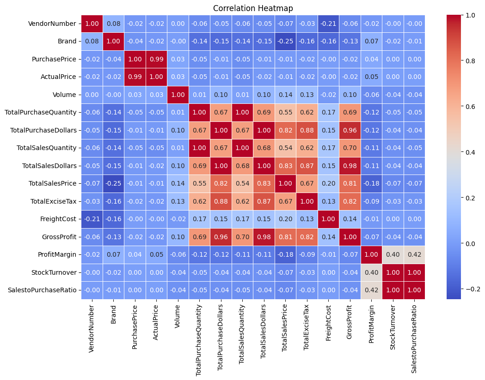
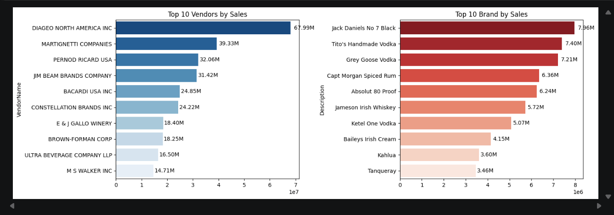

# Vendor Performance Dashboard

### Correlation Heatmap (EDA)


### Top Vendors & Brands by Sales (EDA Chart)


### Power BI Dashboard Overview


## Project Overview

This project analyzes vendor performance using inventory, purchase, sales, and invoice data. The objective is to identify top-performing vendors, evaluate inventory efficiency, analyze profitability, and generate business insights through SQL, Python, and Power BI.

The project follows a complete data analytics workflow:

Data Ingestion → Database Creation → SQL Analysis → EDA → KPI Generation → Power BI Dashboard

---

## Project Structure

```text
vendor-performance-dashboard/
│
├── data/
├── notebooks/
├── scripts/
├── database/
├── outputs/
├── powerbi/
├── images/
├── README.md
└── requirements.txt
```

---

## Dataset Files

The project uses the following datasets:

- begin_inventory.csv
- end_inventory.csv
- purchase_prices.csv
- purchases.csv
- sales.csv
- vendor_invoice.csv

---

## Technologies Used

- Python
- Pandas
- NumPy
- DuckDB
- SQL
- Jupyter Notebook
- Power BI
- Git & GitHub

---

## Data Ingestion

Data from multiple CSV files is loaded into DuckDB using Python scripts.

Key Script:

```bash
scripts/ingestion_db.py
```

This script:

- Reads CSV files
- Creates database tables
- Loads data into DuckDB

---

## SQL Analysis

SQL queries were used to:

- Calculate vendor sales performance
- Analyze purchase trends
- Measure inventory turnover
- Calculate unsold inventory value
- Evaluate profit margins

Database:

```text
database/inventory.db
```

---

## Exploratory Data Analysis (EDA)

EDA was performed using Pandas and visualization libraries to understand:

- Sales distribution
- Vendor contribution
- Inventory behavior
- Profitability patterns

Notebook:

```text
notebooks/EDA.ipynb
```

---

## Vendor Performance Metrics

The following KPIs were calculated:

### Sales Metrics

- Total Sales
- Sales Contribution %
- Gross Profit

### Purchase Metrics

- Total Purchase Value
- Purchase Contribution %

### Inventory Metrics

- Unsold Inventory Value
- Inventory Turnover

### Profitability Metrics

- Profit Margin %
- Vendor Ranking

---

## Dashboard Features

The Power BI dashboard includes:

### Executive KPIs

- Total Sales
- Total Purchases
- Gross Profit
- Profit Margin

### Visualizations

- Top Vendors by Sales
- Top Vendors by Profit
- Purchase Contribution Analysis
- Unsold Inventory Analysis
- Vendor Comparison Matrix

Power BI File:

```text
powerbi/Vendor_Performance_Dashboard.pbix
```

---

## Key Insights

- Identified top-performing vendors based on sales and profit.
- Detected vendors with high unsold inventory.
- Analyzed vendor contribution to total purchases.
- Measured profitability across vendors.
- Generated actionable business insights for inventory optimization.

---

## How to Run

### Clone Repository

```bash
git clone https://github.com/your-username/vendor-performance-dashboard.git
```

### Install Dependencies

```bash
pip install -r requirements.txt
```

### Run Data Ingestion

```bash
python scripts/ingestion_db.py
```

### Generate Vendor Summary

```bash
python scripts/get_vendor_summary.py
```

### Open Dashboard

Open:

```text
powerbi/Vendor_Performance_Dashboard.pbix
```

in Power BI Desktop.

---

## Dashboard Screenshots

Add screenshots inside the images folder and reference them here.

Example:


---

## Author

**Israr Shekh**

- Full Stack Developer
- Data Analytics Enthusiast
- Learning AI/ML and Cloud Technologies

GitHub: 
LinkedIn: 